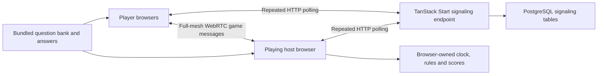
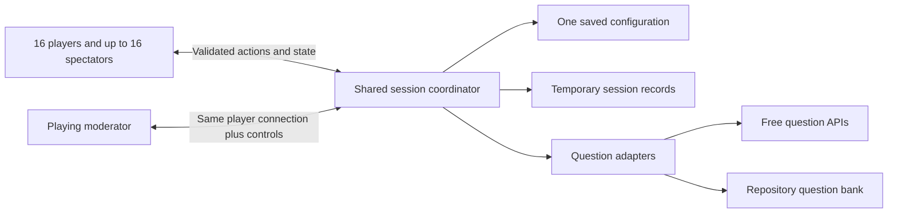

# Snapper: architecture and product design audit

Working planning document. Confirmed requirements record the user's decisions; unresolved details and recommendations are identified separately. Audited checkout: `4387a8c`. This is the historical pre-implementation audit; application code has since changed. Read [implementation.md](implementation.md) for the active architecture and verification status. For future sessions, start with [the product design](product-design.md) and [the project agent instructions](../AGENTS.project.md). This audit records the current prototype's gaps and the reasoning behind the proposed architecture.

Provider research checked during the 2026-09-25 planning audit; recheck free-plan terms and integration documentation before deployment.

## Requirements driving the architecture

The authoritative, maintained requirements are in [product-design.md](product-design.md). The constraints most consequential to this audit are:

- No spending: free services must enforce limits rather than bill overages.
- One owner-opened lobby, up to 16 players and 16 approved spectators, and an assumed one-hour weekly session.
- The owner controls admissions and saved settings; temporary moderators control gameplay. Guest accounts are unnecessary.
- One saved configuration, temporary session recovery/state, and explicitly permitted browser-local nickname/sound preferences.
- Eight text question formats, FFA or two teams, equal team allocations for unequal rosters, server-arrival buzzing and current-question corrections.
- No unrevealed words or answer keys on player/moderator devices. A playing moderator cannot serve as a trusted repository of hidden answers.
- Free content retrieval with reviewed repository fallback, supported filters and within-session deduplication.
- Desktop/mobile support with a bright game-show visual direction and the agreed accessibility baseline.

Disconnected seats are released immediately, while identity, score history and fixed-block membership remain separate. An approved spectator may claim an opening, subject to the existing question/block participation boundary. This distinction is essential to the recovery model.

Spectators do not keep an empty session alive: the last connected player's departure ends it and clears its live data. While a session remains active, a returning player whose former player/team place has filled waits as a spectator with their identity and score preserved, without displacing the current occupant.

## Current architecture

The host is also one of the browsers in the full mesh. Guests connect to one another as well as to the host. SQL stores connection coordination data, not the authoritative match state.

### What is worth retaining

- The rules reducer in `src/game/engine.ts` separates many game transitions from React and is a useful starting point for a tested rules engine. It is not fully deterministic today: question dealing calls `Math.random()` inside the transition path. Selection should become an explicit input to deterministic rules.
- React components already cover lobby, question display, buzzer, typed answers, scores, chat, team selection and end-of-packet results.
- A source-controlled question bank already exists; a paid question database is not needed to use it.
- The current app builds and typechecks. Its desktop and mobile landing-page render checks passed in the deployment review.

### Structural findings

1. **The current network model is more complex than this product needs.** At 16 players a full mesh has 120 peer pairs, with 15 connections per browser. A single authority still decides the game. A shared coordinator would need one connection per player; a browser-hosted star would need 15 pairs, but would retain host availability and WebRTC relay concerns. Evidence: `src/lib/multiplayer/p2p.ts`, `src/game/use-room.ts`.
2. **The host browser controls time.** `requestAnimationFrame` advances the game, so sleeping or backgrounding the host browser affects everyone. Some progress uses frame deltas, while deadlines use wall-clock time. Moderator privileges should be considered separately from the location of the game authority. Evidence: `src/game/use-room.ts:159`.
3. **Refresh does not preserve a player's seat reliably.** A mount generates a new peer ID. The host marker survives refresh, which can initialize a new lobby while existing guests retain higher sequence numbers. Host migration also depends on HTTP presence disappearing, rather than detecting every failed game connection. Evidence: `src/lib/multiplayer/use-p2p-room.ts:31`, `src/routes/index.tsx:58`, `src/game/use-room.ts:73`.
4. **The playing host has a latency advantage.** Their actions execute locally; guests' actions wait for delivery. A shared coordinator removes that particular advantage, but cannot remove all geographic/network latency. The agreed replacement policy is first valid buzz received by the shared server.
5. **SQL signaling is continuously active.** At the healthy two-second interval, 16 players produce approximately 28,800 polls per hour and at least three SQL queries per poll. This is a calculation from the implementation, not a predicted usage requirement. Connecting or stalled peers poll faster. Evidence: `src/lib/multiplayer/p2p.ts:77`, `src/lib/multiplayer/signaling.server.ts`.
6. **Session-only deletion is not implemented.** The signaling records have logical age limits, but pruning is opportunistic on subsequent requests. The last session's records can remain after everyone leaves. Browser-local nicknames and sound preferences are separately retained; the user explicitly permitted those two preferences, so their retention is not a defect. Evidence: `signaling.server.ts:24,121`, `landing.tsx:30`, `match-view.tsx:72`.
7. **Room membership and host authority are weakly enforced.** Signaling accepts caller-supplied identities; clients do not consistently verify that snapshots come from the current authority. A room code is not equivalent to host authorization. Runtime validation, admission policy, rate limits and one-lobby enforcement need explicit design. Evidence: `src/lib/multiplayer/signaling.server.ts:102`, `src/game/use-room.ts:87`.
8. **Dynamic questions cannot simply replace the current IDs.** All clients resolve question IDs against their bundled bank. New questions require a normalized session question contract and a decision about which fields are revealed to players and when. Evidence: `src/game/engine.ts:63,138`.
9. **Current judging is not robust enough for the requested scope.** Read-only checks confirmed that the judge accepts “not gravity” and “gravity or electricity” for “gravity”, but rejects the explicitly allowed symbol “π”. External answer lines can also require prompts, required words, explicit rejections, units or ordering. A wrong answer that resumes reading is not kept as an overturnable ruling; the current override only works in final reveal. Team totals also follow a player's current team, so moving teams moves previously earned points. A session record of submissions, rulings and score changes needs explicit correction and team-attribution rules. Evidence: `src/game/judge.ts:39`, `src/game/engine.ts:256,516`, `src/components/lectern/match-view.tsx:39`.
10. **The requested settings are not represented yet.** Current room settings cover free-for-all/two teams, an optional fixed penalty, three reading speeds and four question sets. Most scoring and timing values are constants. No shared saved configuration exists. Evidence: `src/game/engine.ts:14,100`.
11. **The tests primarily cover the template, not the game.** There are no dedicated engine, judge, multiplayer or session-recovery tests. The deployment review found 235 passing tests across the two test stages and 15 failing template tests. That is not evidence that simultaneous buzzing, fairness or recovery works.
12. **Deployment has remaining dependencies and assets.** Without `DATABASE_URL`, the current production bundle crashes loading missing PGLite data. The PWA icon referenced by the manifest returns 404. These matter if the existing server stack is retained; they are not reasons to select that stack for the redesign.

## Hosting recommendation and alternatives

**Recommended direction: Cloudflare Workers Free, static React assets, and one SQLite-backed Durable Object with a fixed identity for the single session coordinator.** This best matches one active lobby, enforced free limits, temporary recovery state and one saved configuration. This is a planning recommendation, not a provisioned or tested deployment. Vercel is no longer a product constraint.

| Candidate | Fit | Tradeoffs requiring a decision |
|---|---|---|
| Static frontend plus one authoritative Cloudflare Durable Object | A single game authority, WebSocket connections, optional session recovery records and shared saved configuration can live together. Workers Free has enforced daily limits. | Hosting change or second provider; free quota exhaustion interrupts service. Object memory can disappear on restart or hibernation, so recovery needs temporary stored state. |
| Vercel frontend/functions plus a free coordination service | Preserves the current deployment target while moving authority out of a player's browser. | Two services, additional setup and quotas. Vercel WebSockets alone do not provide guaranteed shared in-memory state. |
| Browser-hosted game with a simpler star network | Keeps match authority in a participant's browser and reduces mesh connections. | Host sleep/departure, latency advantage and restrictive-network connectivity remain. A reliable relay must also fit the zero-cost requirement. |

Cloudflare Durable Objects are available on Workers Free. Its documented free allowances are 100,000 requests/day and 13,000 GB-seconds/day; excess free usage fails rather than automatically charging. These are provider terms, not a promise of uninterrupted hosting. [Pricing](https://developers.cloudflare.com/durable-objects/platform/pricing/), [lifecycle and memory loss](https://developers.cloudflare.com/durable-objects/concepts/durable-object-lifecycle/), [static asset limits](https://developers.cloudflare.com/workers/static-assets/billing-and-limitations/).

The owner-approved admission requirement reduces casual unauthorized gameplay. It cannot guarantee that strangers consume no quota: requests rejected by a Worker still reach that Worker. A closed session should serve a static page without starting game connections or repeated polling. Authenticate and validate admission before allocating gameplay state or fetching questions. These are proposed controls, while enforced free limits remain the spending boundary. [Worker limits](https://developers.cloudflare.com/workers/platform/limits/).

For the delegated owner sign-in choice, GitHub OAuth is the planned option. Register one OAuth app and keep its client secret in hosting secrets. Use the verified immutable GitHub account ID as the owner allowlist, not a caller-supplied name or the first account to sign in. The authorization flow needs only public identity; it need not request repository access or create accounts for friends. Issue an application session cookie after verification rather than retaining provider tokens as game credentials. This requires one-time setup, but no separate authentication database. [GitHub registration](https://docs.github.com/en/apps/oauth-apps/building-oauth-apps/creating-an-oauth-app), [authorization flow](https://docs.github.com/en/apps/oauth-apps/building-oauth-apps/authorizing-oauth-apps), [scopes](https://docs.github.com/en/apps/oauth-apps/building-oauth-apps/scopes-for-oauth-apps).

For illustration, at the user's one-hour capacity assumption, 32 participants (16 players and 16 spectators) each sending one message every ten seconds would produce 11,520 incoming messages. Using the documented WebSocket billing ratio, plus an illustrative 80 connections/reconnections and 120 phase alarms, that is about 776 request units. A continuously active object would use approximately 461 GB-seconds. This is a capacity estimate, not a measured load test; actual traffic from players, strangers and other account workloads remains relevant. Send authoritative phase transitions and deadlines, letting browsers animate already-revealed material locally. The confirmed secrecy rule requires server updates that release text only as it becomes visible; do not send future words to the browser with a client-side reveal schedule. Use active reading timers without writing state or scheduling a durable alarm for every word or animation frame. Durable Objects have one pending alarm per object and alarms may retry, so deadline handling must be idempotent. [Alarm documentation](https://developers.cloudflare.com/durable-objects/api/alarms/).

Vercel now supports WebSockets in public beta, including on Hobby. Connections are bounded by function duration and reconnections can reach another instance; its documentation calls for external coordination for shared state. The old blanket statement that Vercel cannot run WebSockets is outdated. [WebSockets](https://vercel.com/docs/functions/websockets), [function limits](https://vercel.com/docs/functions/limitations), [Hobby](https://vercel.com/docs/plans/hobby).

Public STUN servers do not guarantee WebRTC connectivity across all networks. TURN relaying is needed when direct connections fail. [WebRTC guidance](https://webrtc.org/getting-started/turn-server).

## Questions and content

The existing bank contains 35 questions. Its schema has text, category, canonical answer, aliases and a power marker. It lacks provenance, source rights, difficulty and the structures needed for specialized rounds.

The agreed format inventory is larger than the available content inventory. No source in this audit was shown to supply every Reach format ready to play. Ordered sequences, assigned-seat rounds, linked clues, shootouts and team follow-ups need explicitly compatible content. A fallback bank must contain complete examples of each enabled format; it must not silently relabel unrelated trivia as a linked question group.

| Source | Potential use | Constraints |
|---|---|---|
| QBReader | Progressive tossups and grouped bonuses; category/difficulty metadata; free retrieval and answer-checking tools. | Public API has a 20 requests/second limit. Questions remain copyrighted by their authors; noncommercial use is stated, but this does not establish a blanket license to redistribute every packet in a repository. |
| Open Trivia DB | Short multiple-choice and true/false questions, with no API key. | Up to 50 per request and one request per IP per five seconds. CC BY-SA attribution and adapted-content conditions apply. Converting a multiple-choice question to typed response needs alias and ambiguity handling. |
| The Trivia API | Short trivia with category and difficulty. | Free noncommercial access and CC BY-NC attribution terms. Native text-input questions and intelligent answer checking are paid features. |
| Original or clearly licensed repository packs | Reliable fallback, custom formats and questions independent of a live API. | Editorial review and provenance maintenance; a finite pool repeats across sessions unless history is retained. |

Sources: [QBReader API](https://www.qbreader.org/tools/api-docs/), [question schema](https://www.qbreader.org/tools/api-docs/schemas/), [question-use statement](https://github.com/qbreader), [Open Trivia DB](https://opentdb.com/api_config.php), [The Trivia API](https://the-trivia-api.com/).

Protobowl is a product reference, not an assumed integration or reusable question corpus. No supported public question API was established in this audit, and its upstream code license asks prospective users to contact the authors. Reach's official FAQ describes paid question packs; no free licensed Reach corpus was established. [Protobowl license](https://github.com/neotenic/protobowl/blob/master/LICENSE), [Reach FAQ](https://reachforthetop.com/faq/).

### Source capability limits

English is the confirmed initial language for questions and interface. QBReader and Open Trivia DB do not expose a language selector in their documented retrieval APIs; that does not prove every item is English or establish multilingual coverage. The Trivia API documents its language selection as a paid subscription feature. Additional languages would require another verified free source or reviewed repository content. Show only languages actually supported by the available inventory, and treat interface language separately. [QBReader parameters](https://www.qbreader.org/tools/api-docs/random-tossup), [Open Trivia DB configuration](https://opentdb.com/api_config.php), [The Trivia API documentation](https://the-trivia-api.com/docs/).

Keep each provider's original difficulty label. QBReader's school/college/open levels and the other services' easy/medium/hard labels are not demonstrated equivalents. Any common difficulty bands need a documented mapping and calibration; unrated content should not silently become medium. Categories should similarly map through explicit provider adapters, with unsupported filters visible to the owner.

Removing multiple-choice options is not sufficient to make a question suitable for typed answers: a stem may refer to the choices, omit alternatives that are equally correct, or rely on an image. Filter or review those items before selection. Preserve formatted answer lines and accept/reject/prompt directives separately from display text. Validate that every group has a matching answer specification for every part; QBReader documents some mismatched bonus arrays. [Bonus schema](https://www.qbreader.org/tools/api-docs/schemas/), [answer checker](https://www.qbreader.org/tools/api-docs/check-answer).

### Content contract and completeness

Use a normalized content record containing stable identity/version, underlying source IDs, language, topics, original difficulty, provenance/rights notices, review status, presentation data and structured answer rules. Keep reusable question atoms separate from groups and from gameplay recipes. Assigned questions and Shootouts can reuse short-question atoms; the game engine supplies their turn and eligibility rules. Sequences need an ordering instruction and aliases per item; four-clue items need four deliberately authored clues, not four random excerpts.

Deduplication must include underlying question IDs as well as group IDs, so a bonus part cannot later recur as a Snapper in the same session. Shared source identity can also link live and bundled copies. Detecting every semantic paraphrase across unrelated providers is not an established guarantee.

Assess fallback coverage for each supported combination of language, topics, difficulty and format. A large total bank can still be empty under a narrow filter. At an illustrative 30 seconds per answerable prompt, one hour consumes 120 prompts; at 15 seconds, 240. These are sizing scenarios, not requirements or measured pace. Group parts consume separate prompts. Purpose-built fallback content is required for normal delivery of the full format inventory, as well as outage recovery.

For live retrieval, questions should be fetched once for the session, normalized and buffered before they are needed. A time-critical buzz should not depend on an upstream content request. Bundled fallback, per-session deduplication and skipping exhausted formats are confirmed. Pause if all enabled formats are exhausted, keeping saved settings unchanged. Retry behavior and attribution presentation still need implementation specifications. “New” questions could mean unseen existing questions, newly published questions or generated questions; that meaning is not assumed.

## Candidate boundaries for the redesign

These are architectural boundaries to evaluate, not approved implementation tasks:

- **Rules engine:** validated actions, explicit phases, scoring, eligibility, ordered buzz decisions and moderator corrections. Independent of UI and transport.
- **Question catalog/providers:** normalize provider formats, preserve attribution, validate answer rules, select and buffer content.
- **Session coordinator:** owner-authorized availability, guest admission, membership, recoverable identity, authoritative time, session-only moderator roles, revisioned state and cleanup.
- **Player view:** only the question/answer fields a player is entitled to see at that point; full editorial answer lines need not be shipped in advance.
- **Shared configuration:** one versioned product-wide record, with explicit edit permissions and rules for when changes take effect.
- **Frontend:** public-lobby joining, owner-only configuration, gameplay, scores, challenges and connection/recovery states.

An example direction, conditional on hosting and access decisions:

### State and authority contracts

- **Deployment configuration:** hosting bindings/secrets and the allowed owner's immutable GitHub ID. These are installation settings, not saved player profiles.
- **Persistent product configuration:** one validated record with a schema version and revision. Only the owner writes it; all admitted participants can see the effective rules.
- **Temporary session state:** session generation, approved guests, player identity/team, spectators, moderator grants, pending admissions, current block/question, scores, chat, seen question identities and recovery state. Clear it at the agreed session end. Pending queues and histories must be bounded.
- **Private question state:** full unrevealed text, answer rules, source data and buffered future questions. Never serialize this directly as a player snapshot.
- **Public session view:** revealed text, effective settings, roster/eligibility, scores, deadlines, chat and current-question rulings. Include a monotonically increasing revision and session generation.
- **Client commands:** explicit typed actions with a unique command ID and expected question/block identity. Verify identity, role, membership, eligibility, payload bounds and phase before applying them. Duplicates must not score, spend a turn or approve a guest twice.

The coordinator owns buzz ordering and deadlines; the moderator is a permissioned participant, not the authoritative browser. Reconnection receives a fresh public snapshot for the same server-issued identity. A display name alone must never reclaim a seat or moderator role. Guest credentials expire with the session generation; permission to remember a browser nickname and sound preference does not authorize durable player profiles.

Store recovery checkpoints on accepted gameplay/state changes rather than every rendered word. Keep the current question's pre-question state and submission records so corrections can recompute scores, team credit use and Shootout eligibility consistently. In particular, overturning the last answer that unlocked a smaller team's new Shootout cycle must restore the previous cycle correctly.

Distinguish session identity, occupied seat, connection and frozen block membership. A disconnection immediately frees the seat/team capacity, while the departed identity's scores and block membership remain recoverable. An approved spectator can claim the opening but does not inherit the departed person's turn or eligibility. Frozen block rosters must not shrink: removing an unscored player could allow a smaller team to recycle its strongest scorers.

Timers continue and missed turns are forfeited. Resolve normal deadlines and completion first; an exhausted question should reveal and a finished block should end, rather than pause merely because nobody remains eligible. Pause at a progression boundary only when continuing requires an eligible disconnected participant. A moderator may end the block if that participant will not return. Newest-tab takeover replaces the old connection atomically so the old socket's closure cannot release the new connection's seat or trigger empty-session deletion.

Base empty-session cleanup on connected players occupying seats, not total sockets, spectators, retained identities or current answering eligibility. A seated newcomer waiting for the next block counts; a spectating owner does not. When the last player disconnects, teardown takes precedence over block completion, challenges or reconnect holds: clear temporary state, invalidate its admission/moderator grants and notify remaining spectators that the session ended. Serialize seat claims and departures so a stale claim cannot revive a cleared session. Keep the global configuration separate from that deletion. Recovery applies only before session teardown; it must not resurrect an ended game.

The core progression should model a session containing rounds and question attempts: waiting, round setup, question active, answering, adjudication, and question/round completion. An incorrect response can resume reading, unlock a steal or end the question according to the format. Presentation (text, clues or media), answer shape (text, number, choice or list), eligibility (everyone, team or assigned player) and scoring must be separable. This lets several Reach formats share mechanics without claiming one giant collection of Boolean settings can represent every game.

For the confirmed text-only scope, avoid building speculative media or multiple-choice engines. Keep an extensible question contract, but implement only the presentation and answer shapes that the eight agreed formats require.

A moderator correction should refer to a specific submission and score event. A team score event records the team that earned it, independently of the player's subsequent team membership. Configuration should be versioned and validated; each format block captures the revision in force when it starts. Changes are saved immediately for future use and become active at the next block, as approved. These contracts make later changes reviewable and prevent an in-progress score or timer changing accidentally when global defaults are edited.

Changing between FFA and team mode resets scores at the boundary, but keeps chat and seen-question history within the session. Treat moderator score reset as a separate action from ending the session; only the owner can close it. Moderator gameplay controls must not imply permission to admit guests, modify saved settings or grant further moderators.

Cloudflare storage recovery can restore database contents from the past 30 days. The user has confirmed that deletion from the live application is sufficient, so this recovery history does not conflict with the requirement. Session cleanup must still remove live gameplay records while retaining the global configuration. [Storage recovery](https://developers.cloudflare.com/durable-objects/api/sqlite-storage-api/).

## Format rules: accepted defaults and pending details

These are Snapper house rules, not a claim of official Reach compatibility. The user accepted the proposed point values, all-or-nothing ordered Sequences, exclusive Team bonuses without steals, four-clue values, lockouts, clarification, Assigned handoffs and the larger-team adaptation.

| Format | Proposed starting behavior |
|---|---|
| Long tossup | Progressive text; 15/10 points; optional −5. A wrong answer locks that player in FFA or their team until the question ends. |
| Short Snapper | 10 points; the same lockout rule, without a power bonus. |
| Open Questions | Related, independently scored Snappers; 10 each. Group size remains to be finalized. |
| Sequence | 20 points for the complete ordered list; no partial credit. |
| Team scramble/bonuses | 10-point scramble unlocks three exclusive 10-point follow-ups; no steals. First teammate to buzz gets the team's single attempt. Disable this inherently team-based format in FFA. |
| Assigned | 10 points; equal primary opportunities per team, with smaller-team repeats. A miss/timeout gives one designated opponent an attempt; in FFA, the next player in the rotation. |
| Who/What Am I | Four clues at 40/30/20/10; one attempt per player/team per clue. |
| Shootout | Correct answers earn 10 and retire that player. FFA cap: `max(12, 2 × starting players)`. Equal team opportunities require the additional adaptation below. |

Open Questions have independent subquestions. Assigned and Shootout depend on a fixed starting roster, and bonus entitlement depends on the team that won its scramble. The user approved admitting new players and applying team changes at the next block for roster-dependent formats. A reconnecting player keeps the eligibility attached to their existing identity.

An **atomic question** means one prompt and its scoring opportunity; a **block** means linked questions governed by one format. The user explicitly chose to finish the **entire block** if the last moderator leaves, then pause. This supersedes the earlier current-question wording. The no-eligible-connected-player pause still prevents wasting questions when the block cannot progress. Saved settings changes also apply at the next block.

For uneven self-selected teams, **equal team scoring opportunities are required**. Approved adaptation: let `N` be the larger starting team size. Assigned blocks give each team `N` primary turns, cycling through the smaller roster only after everyone has had a turn. Shootouts give each team up to `N` scoring successes; a smaller team's players re-enter only after every teammate has scored in that cycle. Use at most `max(12, 4 × N)` prompts. Thus 3-versus-5 gives five primary Assigned turns per team and up to five Shootout successes per team, with a 20-prompt Shootout cap. This explicitly modifies the original Shootout proposal. It guarantees equal primary allocations and team scoring ceilings, not equal individual turns or winning odds. Dropout behavior must not let a team recycle its strongest scorer by disconnecting an unscored teammate.

Team Shootout ends when **both teams** have used their allocation or the prompt cap is reached, not when the first team finishes. Count each presented prompt once; reconnection, answer attempts and correction do not increase the cap. Eligibility and score-credit effects of a correction must be recomputed from the current question's starting state.

Corrections are allowed **only while the question is current**. The engine must retain all submissions and their score/eligibility effects for that question, including an incorrect answer after reading resumes. The earliest attempt now judged correct wins; later scoring in that question is undone. Once an answer has been revealed, correction does not reopen the question for more attempts. Once the next question starts, the old ruling is final; do not add late score adjustments or cascading rewinds. A question's reveal interval is still part of that current question.

A player can press **Challenge** while the question is current. This holds advancement until a moderator resolves it; it does not itself overturn a ruling. If all moderators are absent, a pending challenge prevents advancement until one returns, even though the normal departure policy otherwise allows the block to finish.

Use **independent random format choices**, as selected by the user, once per block. Do not substitute a shuffled bag or enforce format-repeat prevention. Temporarily exclude formats with no unseen compatible content, and pause if none remains; preserve both the saved configuration and question-repeat prevention.

## Interface and interaction audit

- The current landing page centers solo practice and room-code creation. The new entry point is one lobby at a fixed URL, opened by the owner, who approves every participant. Joining, seeing the current game and determining who can edit settings should be a direct flow. One player can play alone there; no separate private practice route is required.
- The lobby currently exposes only four packet presets, two teams/free-for-all, an optional penalty and three speeds. The requested configuration needs clear groups for content, formats, participants, scoring and timing, rather than an undifferentiated list of controls. Only the owner can change the saved configuration; players should still be able to see the rules in effect.
- Current connection failures can leave players on waiting text. The redesigned interface needs distinguishable connecting, reconnecting, lobby-full, source-unavailable, match-ended and quota-unavailable states, with actions appropriate to each. These are product error states, not raw provider errors.
- The moderator currently controls play through the same page used for competing. Keep moderation controls distinct enough to avoid accidental skip/reset actions, and show what a correction changes before committing it. Moderators receive no unrevealed clues or answer keys while playing.
- On mobile, the typed-answer form, keyboard, visible question and countdown must remain usable together. Reconnecting must not silently substitute a different identity or discard a response without feedback.
- Keyboard buzzing must not swallow normal keyboard interaction with buttons and settings. Current global Space handling needs a focus-aware policy; reading updates and timers also need a deliberate screen-reader approach.
- A current-question view, round context, visible eligibility and score/ruling history will be needed for specialized formats. For example, an Assigned question must make clear who may answer; a Sequence question must express ordering; a Shootout must show who remains eligible.
- Replace the current green/brass paper-card identity and Lectern name with Snapper's bright game-show direction: bold colors, large scores and a prominent buzzer. Current major desktop/mobile browsers and the stated accessibility baseline are confirmed. Detailed palette/layout work is still ahead.

## Decisions and implementation status

Use the [product design's open decision register](product-design.md#open-decision-register) for remaining questions. Do not reopen confirmed product choices or treat this audit's technical recommendations as implemented features.

The audit establishes why the existing browser-hosted prototype needs changes. It does not provision hosting, migrate storage, implement the new rules or verify the proposed runtime. Provider terms and APIs should be checked again when implementation/deployment work begins.

## Verification required before calling a redesigned version ready

The eventual acceptance tests must follow the answers above. At minimum, the audit identifies unresolved coverage for simultaneous buzzes, deterministic score correction, malformed messages, owner-only configuration/admission, session-only moderator grants, refresh/reconnect identity, moderator departure, duplicate connections, empty-room expiry, provider outages, repeat handling, configuration persistence, and consistent play with 16 players plus 16 spectators. Mobile typing, focus, keyboard buzzing and background/resume behavior also need real-browser checks.

Judging fixtures should cover the current false positives (“not gravity”, “gravity or electricity”), supported symbols such as “π”, close numeric values, required units, accepted variants, insufficient names that prompt, explicit reject rules and ordered lists with swapped items. Rules tests should cover 1-versus-8 and 3-versus-5 teams, a cycle-unlocking answer overturned, duplicate submissions, all eligible participants disconnected and a late join or team-switch attempt during a fixed-roster block. Lifecycle tests must include last-player cleanup with spectators still connected, a returner waiting behind a filled room/team place, and a last-player tab takeover that does not accidentally trigger cleanup.

### Migration sequence proposed for later implementation

1. Finalize the remaining product decisions and turn the approved rules into format fixtures. Validate the content schema and create representative fallback content for all eight families before exposing them as available settings.
2. Extract a deterministic rules engine and server/player state boundary. Cover simultaneous buzzes, timeouts, per-format eligibility, equal team opportunities and current-question corrections with behavioral tests.
3. Build one complete owner-opened, approved-guest session through the coordinator: one question, chat, persistent configuration, identity recovery, moderation and deletion. This establishes the network and lifecycle contracts for every format.
4. Integrate all agreed formats, content providers/fallback selection and the approved Snapper interface. This sequence does not reduce the agreed initial format scope.
5. Verify the production runtime, both device layouts and the full 32-participant capacity. Exercise provider outage, coordinator restart, duplicate/reordered actions, full seats, owner/moderator departure and quota-unavailable responses. Measure usage under an illustrative one-hour session rather than relying only on calculations.
6. Configure the Free hosting plan, owner identity and secrets; document deployment, rollback and quota checks. Deployment is a later action, not part of this audit.

This is not a deployment-preset-only change. The existing Vercel/Nitro server, PostgreSQL/PGLite signaling and browser-host authority must be separated from the reusable React UI and game logic. The repository's preview bridge, PWA/branding integration and supported startup/build contract also need compatibility review during migration; they must not disappear as incidental cleanup. Keep existing platform helpers intact unless a later authorized change explicitly replaces their required behavior.

No paid service, migration or implementation change is authorized by this document. It records an audit and questions for planning.
